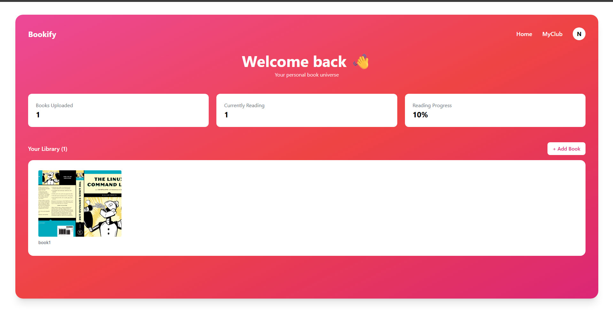
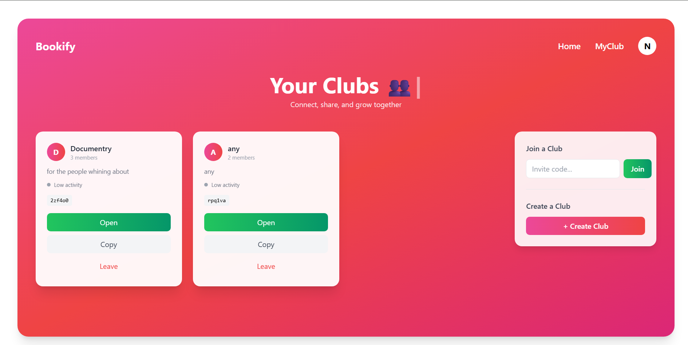
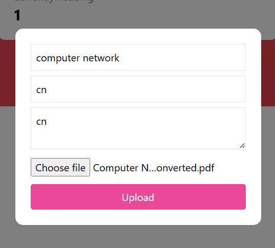
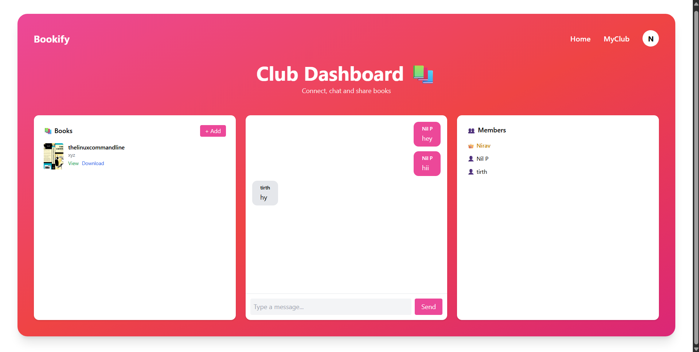

# 📚 Bookify

A full-stack Book Management System that allows users to browse, search, and manage books through a clean and responsive interface.

## ✨ Features

- 🔐 User Authentication (Login & Register)
- 📚 Book Management
- 🔍 Search Books
- 👤 User Dashboard
- 📖 Book Details
- 📱 Responsive Design

## 🛠️ Tech Stack

**Frontend**
- React.js
- CSS

**Backend**
- Node.js
- Express.js

**Database**
- MongoDB

## 🚀 Getting Started

### Clone the repository

```bash
git clone https://github.com/TombStone88/bookify.git
```

### Navigate to the project

```bash
cd bookify
```

### Install dependencies

```bash
npm install
```

### Start the application

```bash
npm start
```

## 📸 Screenshots

### 🏠 Home Page



---

### 🔑 Login Page


---

### 📝 Register Page


---

### 📊 Dashboard



---

### 📚 Book Management



---

### 👤 Profile Page


---

### 🏢 Club Dashboard



## 📂 Project Structure

```
bookify/
│
├── client/
├── server/
├── screenshots/
│   ├── home-page.png
│   ├── login-page.png
│   ├── register-page.png
│   ├── dashboard.png
│   ├── book-management.png
│   ├── profile-page.png
│   └── club-dashboard.png
│
├── Requirements.txt
└── README.md
```

## 🔮 Future Improvements

- Book Recommendations
- Dark Mode
- Wishlist
- Email Notifications
- Admin Analytics

## 👨‍💻 Author

**Dark Knight**

GitHub: https://github.com/TombStone88

---

⭐ If you like this project, consider giving it a star on GitHub!